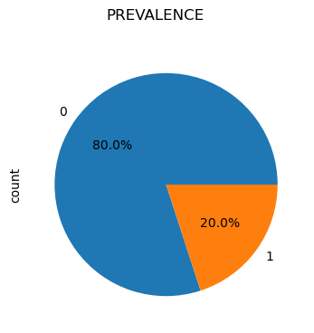
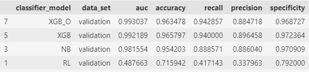
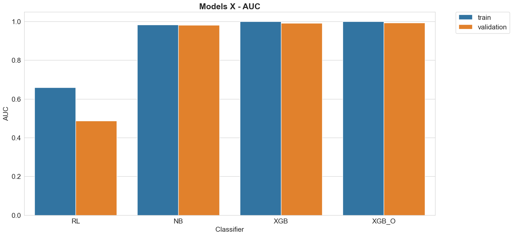
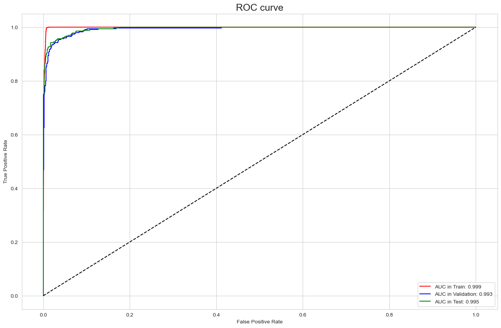
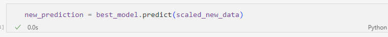

# ML_Industrial_Machine_Maintenance
Implementing machine learning models for prediction maintenance and comparing their performance using a dataset of Industrial Machine Maintenance.

#### Pre-processing:
* StandScaler
* Balance Class

#### Models Classifier:
* Logistic Regression
* Naive Bayes
* XGBoosting (XGBClassifier)

#### Metrics:
* AUC
* ROC
  

#### Parameter Optimization and Cross Validation:
* GridSearchCV

#### Results:

